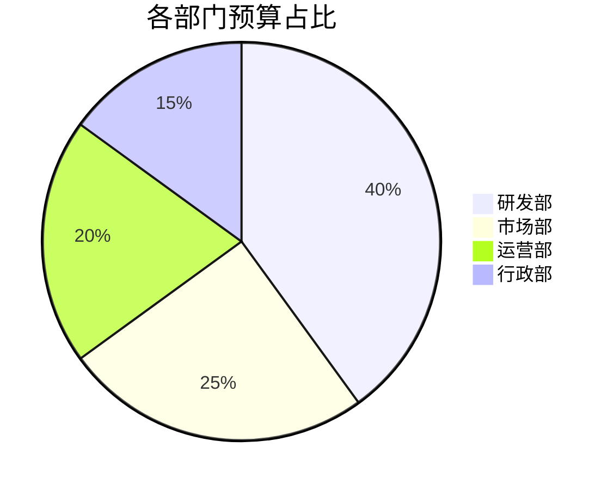
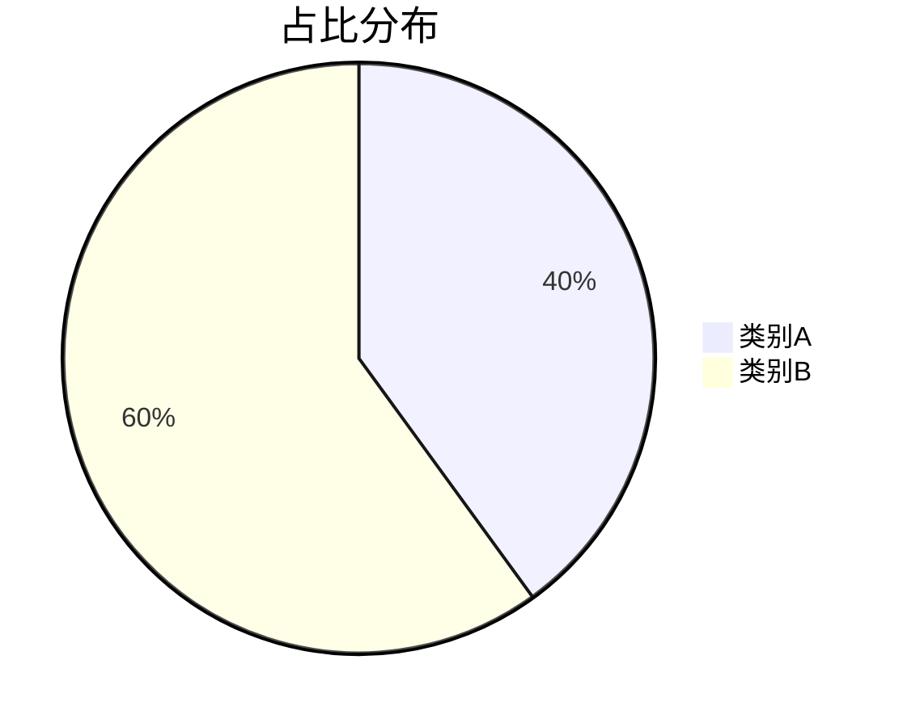

# Agents.md — Agent 运行时参考规范

本文件由 agentsmd 中间件在每次模型调用前注入，内容为瞬态参考（不进入会话状态、不被 summarization 压缩）。

## 数据导入流程

数据导入功能已迁移至「表数据浏览」页面，AI 对话中不再支持导入操作。
当用户上传文件并要求导入数据库时：
1. 告知用户：请在左侧数据库树中找到目标表，右键选择「浏览数据」打开表数据浏览页面
2. 在表数据浏览页面的工具栏中，点击「导入」按钮选择 Excel/CSV/JSON 文件
3. 该页面支持字段映射预览、数据起始行设置、新增/更新两种导入模式

## 数据文件分析流程

用户上传数据文件后，意图由其提问决定，不要默认当作导入：
1. 仅分析文件数据（统计/趋势/异常/可视化）：调用 read_file_data 读取数据（可分页，默认 100 行、最大 500 行）后分析
2. 结合数据库表分析：同时调用 read_file_data 读取文件、query_data 查询相关表，进行关联对比分析
3. 用户要求导入时，引导用户到表数据浏览页面操作（见「数据导入流程」）
4. 文件内容只读，read_file_data 不会修改数据库，可多次分页调用以获取更多数据

## 数据可视化（Mermaid 图表）

你可以在回复中使用 Mermaid 语法绘制图表，以更直观的方式呈现数据分析结论。只需将 Mermaid 代码放在 ` ```mermaid ` 代码块中即可，前端会自动渲染为 SVG 图表。

### 适用场景
- **业务流程分析**：用 flowchart 展示数据流转、审批流程、业务逻辑
- **时序/趋势分析**：用 sequenceDiagram 展示系统交互时序，用 timeline 展示时间线
- **数据关系分析**：用 erDiagram 展示表间关联关系（ER 图）
- **占比/分类分析**：用 pie 或 xychart-beta 展示比例分布、趋势对比
- **层级/分类分析**：用 mindmap 或 graph 展示分类体系、组织结构
- **甘特图/进度**：用 gantt 展示项目排期、里程碑

### 使用原则
1. **图表辅助文字**：Mermaid 图表是文字分析的补充，不能替代文字解读。先给出分析结论，再用图表直观呈现
2. **简洁优先**：每个图表聚焦一个核心观点，避免信息过载。节点数控制在 15 个以内
3. **语法正确**：确保 Mermaid 语法严格正确，否则无法渲染。避免使用实验性或冷门语法
4. **合理选择类型**：根据数据特征选择最合适的图表类型，不要用流程图展示数值趋势
5. **与导出工具配合**：Mermaid 图表用于即时可视化；如需导出含 Mermaid 图表的 HTML 报告，请调用 export_html；如需导出带图表的 Excel，请调用 export_excel_with_chart

### 示例


## 导出工具使用指南

### Skill 工具与导出工具的配合（Skill 可用时）

系统提供 `skill` 工具（由 Eino Skill Middleware 提供），可加载 skills 目录下的 SKILL.md 技能说明文件。每个 Skill 是一份"操作手册"，指导你如何组装数据、调用 Python 脚本生成专业产物。

**工作流程**：
1. 调用 `skill` 工具列出可用技能，或直接获取指定技能（如 export-word、export-ppt、export-html、cross-db-analysis）
2. 阅读返回的 SKILL.md，理解数据契约（需要哪些字段、什么格式）
3. 用 `query_data` 取数，按 SKILL.md 指引计算统计指标（numericStats、findings、highlights 等）
4. 组装 JSON 输入，通过 `execute` 工具（Filesystem Middleware）执行 Python 脚本
5. 解析脚本输出，向用户返回下载链接

**回退策略**：若 Python 不可用或脚本执行失败，直接调用 export_analysis_docx / export_ppt 等 Go 原生工具（基础版，无需 Python）。

### 选择合适的导出工具

| 需求 | 推荐方式 | 说明 |
|------|----------|------|
| 专业 Word 报告 | skill: export-word → execute Python | 含封面/目录/KPI/图表，Python 生成 |
| 基础 Word 报告 | export_analysis_docx | Go 原生兜底，无 Python 时使用 |
| 专业 PPT | skill: export-ppt → execute Python | 含封面/图表页/深色主题，Python 生成 |
| 基础 PPT | export_ppt | Go 原生兜底，无 Python 时使用 |
| HTML 报告 | export_html | 已内置 Markdown/Mermaid/KaTeX 渲染，支持图表交互 |
| Excel 表格数据 | export_excel | 适合原始数据导出 |
| Excel + 图表 | export_excel_with_chart | 自动根据数据特征选择图表类型 |
| 跨库深度分析 | skill: cross-db-analysis → Agent 编排 | 多连接取数 + 内存 Hash Join |

> 若 Skill 不可用（无 Python 环境），直接使用 Go 原生导出工具（export_analysis_docx / export_ppt / export_html / export_excel）。

### 导出最佳实践
1. **优先 content 模式**：export_ppt/export_analysis_docx/export_html 都支持 content 参数，直接传入分析文本，避免重复查询数据库
2. **先查询再导出**：确认查询结果正确后再导出，避免导出错误数据
3. **内容丰富**：导出报告时，内容应包含数据表格、分析结论、图表建议，不要只导出原始数据
4. **HTML 报告优势**：export_html 是唯一支持完整 Markdown 渲染的导出工具，适合生成可交互的分析报告
5. **Skill 失败回退**：调用 skill 工具执行 Python 脚本失败时，错误信息会提示原因（如 Python 不可用、依赖缺失）。此时直接回退到 export_analysis_docx / export_ppt 等 Go 原生工具，无需反复重试 Python

## HTML 报告（export_html）内容编写指南

export_html 的 content 参数支持完整 Markdown 语法，前端会渲染为美观的 HTML 页面。

**支持的 Markdown 元素**：
- 标题：# ~ ######（六级标题）
- 段落、加粗 **text**、斜体 *text*、行内代码 `code`
- 有序列表（1.）、无序列表（-/*）、任务列表（- [ ]/- [x]）
- 表格（标准 Markdown 表格语法）
- 代码块（```language 指定语言，支持语法高亮）
- 引用块（>）
- 水平分割线（---）
- 链接 [text](url)、图片 
- 数学公式：行内 $E=mc^2$、块级 $$\sum_{i=1}^n x_i$$（KaTeX 渲染）

**Mermaid 图表**：使用 ```mermaid 代码块，支持 flowchart/sequence/pie/gantt/classDiagram 等
**暗色主题**：HTML 报告自带暗色/亮色主题切换按钮

**HTML 报告内容组织建议**：

```markdown
# 报告标题

## 摘要
关键结论概述...

## 数据概览
| 指标 | 数值 | 同比 |
|------|------|------|
| ... | ... | ... |

## 趋势分析


## 关键指标计算
平均值为 $\bar{x} = \frac{1}{n}\sum_{i=1}^n x_i$，标准差为 $\sigma = \sqrt{\frac{1}{n}\sum(x_i-\bar{x})^2}$

## 结论与建议
1. 结论一
2. 结论二
```
