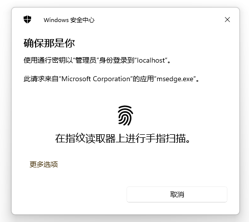
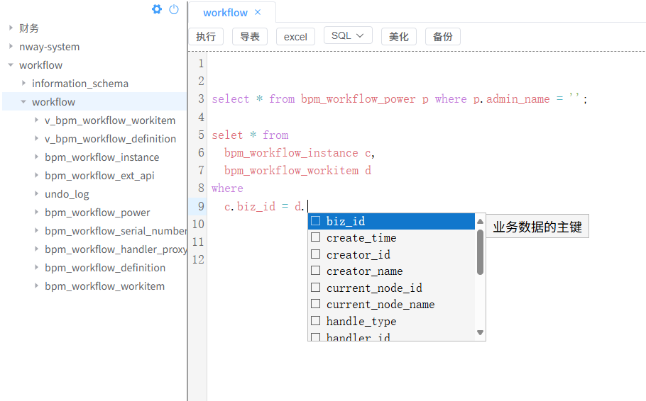
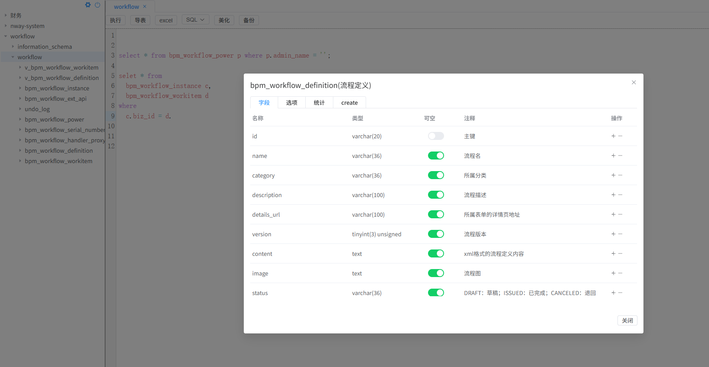
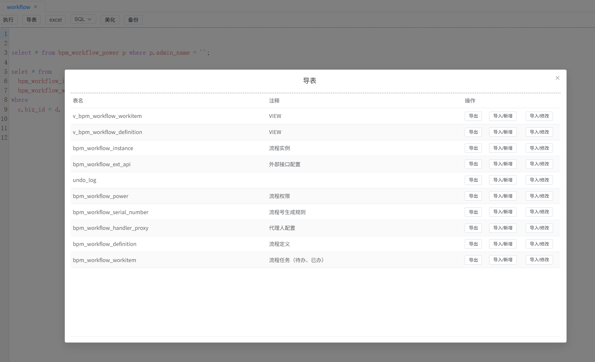

# Web-SQL

一款基于 Go + Vue 开发的现代化 Web 版数据库管理工具，无需任何依赖，跨平台运行，编译后即可直接使用。

## ✨ 核心特性

### 🎯 基础功能
1. **双模式支持** - 支持本地模式和远程部署模式，满足不同使用场景
2. **智能 SQL 编辑** - 支持 SQL 关键字高亮、自动提示表名及字段名
3. **多数据库支持** - 支持 MySQL、Oracle、SQLite 数据库
4. **权限管控** - 严格的链接级权限管理，支持角色和用户管理

### 🔐 安全认证
- **生物识别登录** - 支持基于操作系统的人脸/指纹识别登录（需硬件支持）
- **多种登录方式** - 支持密码登录、生物识别登录、外部 Token 登录
- **会话管理** - 远程模式下完善的会话管理机制
- **IP 访问控制** - 本地模式下可配置允许的 IP 地址

### 📊 数据操作
- **SQL 执行** - 支持 SELECT、INSERT、UPDATE、DELETE、ALTER、DROP、CREATE 等 SQL 语句
- **数据编辑** - 支持在线编辑查询结果数据，可配置是否允许修改
- **自动备份** - 自动备份 DELETE、UPDATE 操作的数据，支持 SQL 审计
- **批量执行** - 支持分号分隔的批量 SQL 语句执行

### 📁 导入导出
- **Excel 导出** - 支持整表导出、自定义 SQL 查询结果导出为 Excel
- **Excel 导入** - 支持从 Excel 文件导入数据到数据库
- **脚本导出** - 支持 INSERT/UPDATE/CREATE 语句导出

### 🤖 AI 智能辅助
- **AI 生成 SQL** - 基于自然语言描述自动生成 SQL 语句
- **AI 对话** - 与 AI 助手对话获取 SQL 编写建议
- **智能上下文** - 自动获取表结构信息，生成更准确的 SQL
- **流式响应** - 支持流式输出，实时显示 AI 生成内容

### 🛠️ 表管理
- **表结构查看** - 查看表定义、字段信息、索引等
- **表创建** - 可视化创建表和视图
- **表编辑** - 在线修改表结构
- **数据浏览** - 浏览表数据，支持分页和过滤

## 📸 界面截图


*指纹识别对话框*


*SQL 自动提示*


*表结构编辑*


*数据导出对话框*

## 🚀 快速开始

### 运行参数
```bash
-port     运行端口号，默认 80
-https    是否为 https，默认 false
-sql      初始化 SQL 文件路径（可选）
```

### 配置文件
文件名：`config.json`

```json
{
    // 是否为远程模式，默认 false
    // 远程模式：有严格的权限管理和会话管理，适合团队共享
    // 本地模式：无权限管理，仅建议本机使用
    "isRemote": true,
    
    // 管理数据库配置
    // 详情参考：
    // SQLite: https://pkg.go.dev/modernc.org/sqlite
    // MySQL:  https://pkg.go.dev/github.com/go-sql-driver/mysql
    // Oracle: https://pkg.go.dev/github.com/sijms/go-ora/v2
    "db": {
        "type": "sqlite",  // 支持：sqlite、mysql、oracle
        "dsn": "nway.sqlite3.db"
        // sqlite: 数据库文件路径
        // mysql:  user:password@tcp(host:port)/db?params
        // oracle: 参考 go-ora 文档
    },
    
    // Redis 配置（远程模式可选）
    // 详情参考：https://pkg.go.dev/github.com/redis/go-redis/v9
    "redis": {
        "addr": "",     // host:port
        "password": "",
        "db": 0
    },
    
    // HTTPS 证书配置
    "https": {
      "organization": "Nway",
      "commonName": "websql.nway.com"
    },
    
    // 外部用户认证接口（可选）
    "outterUser": "http://localhost:8081/nway-system/login/getLoginUser",
    
    // 本地模式下允许的 IP 地址
    "allowedIP": [
      "[::1]",
      "127.0.0.1"
    ],
    
    // AI 配置（可选）
    "ai": {
      "provider": "openai",  // AI 服务提供商
      "baseUrl": "https://api.openai.com/v1",
      "model": "gpt-3.5-turbo",
      "apiKey": "your-api-key"
    }
}
```

## 🐳 Docker 部署

### 使用官方镜像
```bash
docker run -d -p8000:80 \
  -v ./config.json:/app/config.json \
  -v ./nway.sqlite3.db:/app/nway.sqlite3.db \
  zdtjss/websql:v1.5
```

### 自定义配置
```bash
docker run -d -p8000:80 \
  -v ./config.json:/app/config.json \
  -v ./data:/app/data \
  -v ./logs:/app/logs \
  zdtjss/websql:v1.5
```

## 💻 本地开发

### 后端（Go）
```bash
# 安装依赖
go mod tidy

# 运行
go run main.go -port 8080
```

### 前端（Vue 3 + TypeScript）
```bash
cd web-src

# 安装依赖
npm install

# 开发模式
npm run dev

# 构建生产版本
npm run build
```

### 交叉编译
参考 [交叉编译.md](交叉编译.md) 文档

## 🏗️ 技术架构

### 后端技术栈
- **Web 框架**: Gin
- **数据库驱动**: 
  - modernc.org/sqlite (SQLite)
  - github.com/go-sql-driver/mysql (MySQL)
  - github.com/sijms/go-ora/v2 (Oracle)
- **Excel 处理**: excelize/v2
- **Redis 客户端**: go-redis/v9
- **加密安全**: openssl, golang.org/x/crypto
- **工具库**: lancet/v2

### 前端技术栈
- **框架**: Vue 3.5 + TypeScript
- **UI 组件**: Element Plus
- **代码编辑**: CodeMirror 6
- **HTTP 客户端**: Axios
- **Excel 处理**: xlsx, exceljs
- **SQL 格式化**: sql-formatter
- **语法高亮**: highlight.js
- **生物识别**: @passwordless-id/webauthn
- **构建工具**: Vite 7

## 📋 API 接口

### 数据库操作
- `POST /execSQL` - 执行 SQL 语句
- `GET /listTable` - 获取表列表
- `POST /listTableColumns` - 获取表字段信息
- `POST /tableOptions` - 获取表选项
- `POST /tableStatistics` - 获取表统计信息
- `POST /listIndexes` - 获取索引信息

### 导入导出
- `GET /exportXlsx` - 导出表数据为 Excel
- `POST /exportXlsxBySql` - 根据 SQL 导出 Excel
- `POST /importXlsx` - 导入 Excel 数据

### 连接管理
- `POST /saveConn` - 保存数据库连接
- `GET /delConn` - 删除数据库连接
- `GET /connBaseTree` - 获取连接树
- `GET /listConn2` - 获取连接列表
- `GET /showTree` - 显示树结构

### 用户权限
- `POST /login` - 用户登录
- `POST /logout` - 用户登出
- `POST /saveRole` - 保存角色
- `GET /delRole` - 删除角色
- `GET /roleList` - 角色列表
- `POST /saveUser` - 保存用户
- `GET /delUser` - 删除用户

### AI 功能
- `POST /ai/config/save` - 保存 AI 配置
- `GET /ai/config/get` - 获取 AI 配置
- `POST /ai/config/test` - 测试 AI 连接
- `POST /ai/generateSql` - 生成 SQL
- `POST /ai/generateSqlStream` - 流式生成 SQL
- `POST /ai/chat` - AI 对话

### 系统
- `GET /sysMode` - 获取系统模式
- `GET /healthCheck` - 健康检查

## ⚠️ 注意事项

1. **生物识别**：指纹/人脸识别仅在以下条件下可用：
   - 用户操作系统及硬件支持
   - HTTPS 下证书有效可信
   - HTTP 下使用 localhost 访问

2. **Oracle 支持**：目前 Oracle 数据库暂时仅支持 SQL 相关操作，其他功能可能不够完善

3. **安全建议**：
   - 生产环境建议使用 HTTPS
   - 远程模式务必配置 Redis 会话存储
   - 定期备份管理数据库
   - 合理配置用户权限

4. **性能优化**：
   - 查询结果默认限制最大行数（可配置）
   - 大数据量导出建议使用自定义 SQL
   - 批量操作注意事务管理

## 📄 开源协议

宽松的开源协议，可以自由使用，满足个人或企业需求。详见 [LICENSE](LICENSE) 文件。

## 🤝 贡献指南

欢迎提交 Issue 和 Pull Request！

## 📧 联系方式

如有问题或建议，请通过 Issue 反馈。
