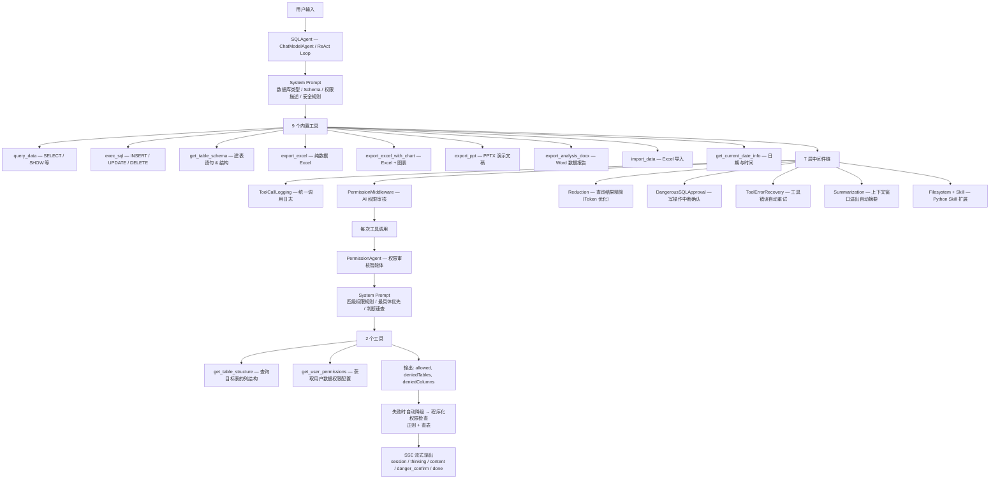
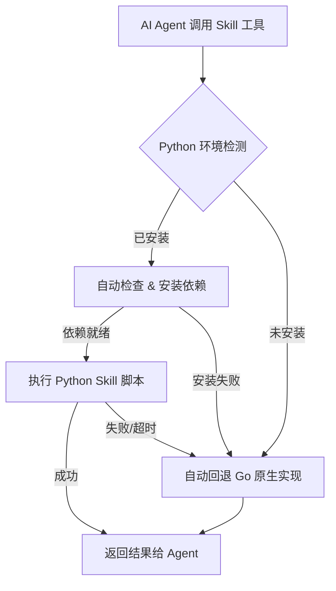
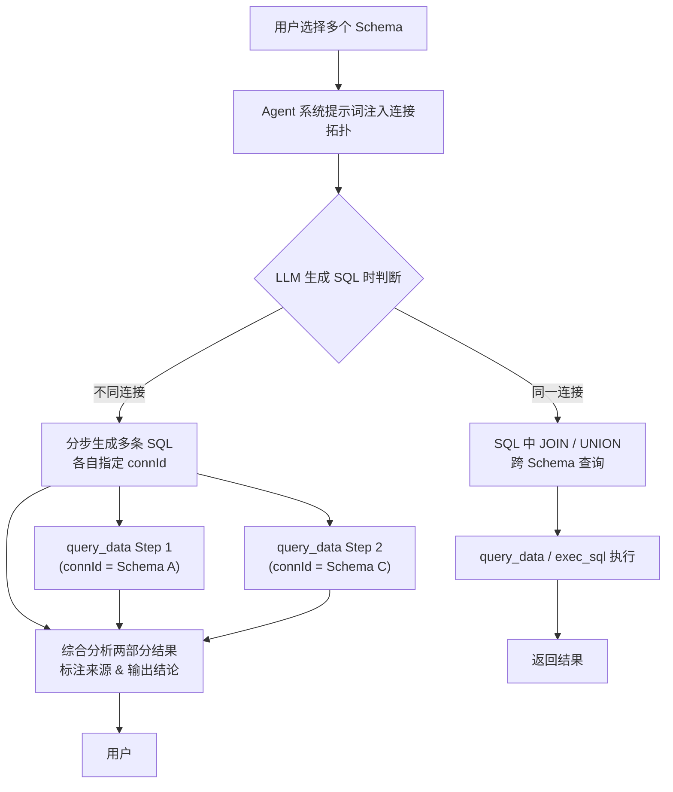
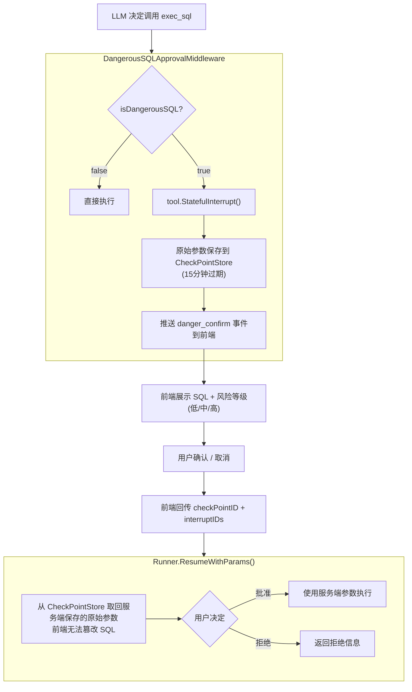
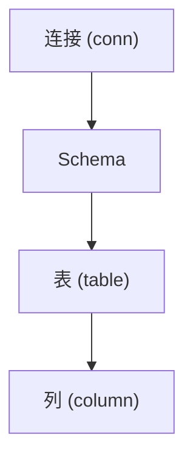
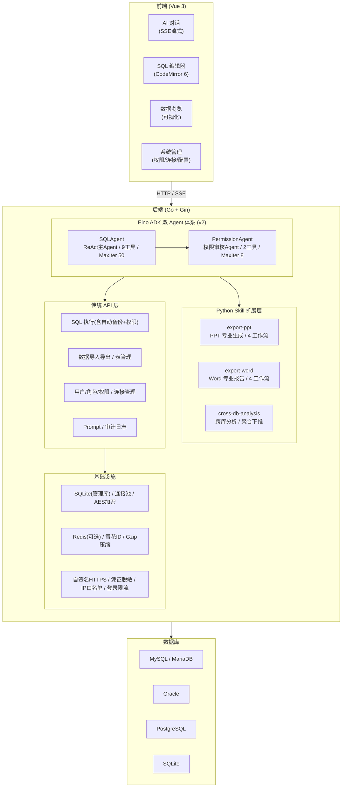

<div align="center">

# WebSQL

**AI 原生数据库管理平台**

[](https://go.dev/)
[](https://vuejs.org/)
[](https://github.com/cloudwego/eino)
[](LICENSE)

*自然语言驱动 · 企业级安全 · 零依赖部署*

</div>

***

> 用一句话描述你想查什么，AI 替你写 SQL、执行、画图、出报告——这就是 WebSQL。

## 在线体验

> [WebSQL 演示环境](http://180.184.30.223:8001/)
>
> - 账号：`admin`
> - 密码：`1`
>
> **注意**：演示服务器带宽有限，首次加载可能较慢，请耐心等待。请文明使用，不要进行破坏性操作。

***

WebSQL 是一个融合 AI 智能体的 Web 数据库管理平台。它基于字节跳动开源的 [CloudWeGo Eino ADK](https://github.com/cloudwego/eino) 构建了完整的 ReAct SQL Agent 与双智能体协作架构，支持自然语言查询、多轮对话、流式输出（含思维链）、智能导出（Excel / PPT / Word / 图表），同时内置四级 RBAC 权限体系、AI 权限审核 Agent、WebAuthn 生物识别、防篡改审批流、登录限流与审计日志。编译产物为单个可执行文件，无任何运行时依赖。

## 亮点速览

| 特性                | 说明                                                                     |
| ----------------- | ---------------------------------------------------------------------- |
| **双 Agent 架构**    | 主 SQL Agent（ReAct + 9 工具）+ 权限审核 Agent，两级智能体协作                          |
| **AI 权限审核**       | 独立的 PermissionAgent 通过 LLM 判断 SQL 是否在授权范围内，程序化检查兜底                     |
| **防篡改审批流**        | Eino Runner + CheckPointStore：危险 SQL 中断 → 服务端保存 → 用户确认 → 恢复执行          |
| **四级 RBAC**       | 连接 → Schema → 表 → 列，双重防线：SQL 解析拦截 + 结果集过滤兜底                            |
| **树可见性控制**        | 独立于数据权限的 showTree 可见性标志，向上传播，跨角色去重                                     |
| **零依赖 Office 生成** | DOCX / PPTX 直接构建 Office Open XML，不依赖任何第三方文档库                           |
| **写操作自动备份**       | UPDATE / DELETE 执行前自动备份原始数据到历史表，支持回溯                                   |
| **语音输入**          | 浏览器原生 Web Speech API，中文语音识别，说完即查                                       |
| **单文件部署**         | Go 编译为单个二进制，`docker run` 或直接运行，零外部依赖                                   |
| **SSE 流式输出**      | 实时输出思维链 + 正文，Mermaid 图表流式渲染，5 秒心跳保活                                    |
| **登录限流**          | IP 级别限流，每分钟最多 10 次登录尝试，防止暴力破解                                          |
| **Skill 系统**      | Python 脚本 Skill 扩展框架，自动检测环境、安装依赖、执行与回退，已内置 PPT / Word / 跨库分析 3 个 Skill |
| **跨库操作**          | 多 Schema/连接同时操作，AI 感知连接拓扑并自动拆分/路由 SQL，支持跨库对比与大数据量聚合分析                  |

## 为什么不是 Navicat / DBeaver / phpMyAdmin？

| <br /> | 传统工具                   | WebSQL                                |
| ------ | ---------------------- | ------------------------------------- |
| 查询方式   | 手写 SQL                 | 自然语言 → AI 自动生成并执行                     |
| 报告产出   | 手动导出 → Excel → 做图 → 粘贴 | 一句话生成带图表的 Excel / PPT / Word          |
| 写操作安全  | 执行前靠自觉                 | AI 中间件自动拦截，前端二次确认，审计日志全程记录            |
| 权限粒度   | 连接级                    | 连接 → Schema → 表 → 列，四级 RBAC + AI 权限审核 |
| 登录方式   | 账号密码                   | 密码 / 指纹面容 / 第三方 Token                 |
| 部署形态   | 安装包                    | 单文件，`docker run` 即用                   |
| 协作方式   | 各自安装客户端                | 浏览器打开，团队共享                            |
| 错误处理   | SQL 报错 → 手动改           | AI 自动分析错误 → 调整参数重试（ReAct 循环）          |
| 长对话    | 上下文溢出                  | 超过模型上下文窗口 85% 自动摘要压缩                  |
| 跨库查询   | 逐个连接切换、手动合并            | AI 感知连接拓扑，自动拆分/路由 SQL，跨库对比分析          |
| 文档产出   | 第三方库或手动拼接              | 内置 Python Skill 引擎，专业级 PPT/Word 一键生成  |

## 核心能力

### AI 双 Agent 架构

WebSQL 采用**双 Agent 协作架构**：主 SQL Agent 负责生成并执行 SQL，权限审核 Agent 独立判断每次工具调用是否在用户授权范围内。



#### 权限审核 Agent 工作原理

PermissionAgent 是一个独立的 `ChatModelAgent`，作为 `PermissionMiddleware` 的内部工具被主 Agent 调用。每次 SQL 工具（`query_data` / `exec_sql` / `export_*`）被调用前，权限中间件将 SQL 和工具名发送给 PermissionAgent：

1. **解析 SQL**：PermissionAgent 从 SQL 中提取所有涉及的表和字段（含 CTE 识别、子查询、`SELECT *` 检测）
2. **查询结构**：调用 `get_table_structure` 获取目标表的列信息
3. **查询权限**：调用 `get_user_permissions` 获取用户在此连接上的权限配置
4. **逐表逐字段比对**：按**最具体优先原则**（table/column 级权限存在时，conn/schema 级权限自动降级）

当 PermissionAgent 调用失败（如 LLM 临时不可用），自动降级为**程序化权限检查**（正则提取表名 + 查 `t_power` 表），确保安全底线不被 LLM 可用性影响。

#### 权限检查覆盖矩阵

| 入口                       | 连接级 | 表级 | 列级(读)   | 列级(写)      | 结果集过滤 | 树可见性 |
| ------------------------ | --- | -- | ------- | ---------- | ----- | ---- |
| `/execSQL`               | ✅   | ✅  | ✅       | ✅          | ✅     | —    |
| `/exportXlsxBySql`       | ✅   | ✅  | ✅       | —          | ✅     | —    |
| `/importXlsx`            | ✅   | ✅  | —       | ✅          | —     | —    |
| `/showTree`              | ✅   | ✅  | ✅       | —          | —     | ✅    |
| AI `query_data` (流式/非流式) | ✅   | ✅  | ✅       | —          | ✅     | —    |
| AI `exec_sql`            | ✅   | ✅  | —       | ✅          | —     | —    |
| AI `get_table_schema`    | ✅   | ✅  | ✅ DDL过滤 | —          | —     | —    |
| AI `export_*`            | ✅   | ✅  | ✅       | —          | —     | —    |
| AI `import_data`         | ✅   | ✅  | —       | ✅ Mapping列 | —     | —    |

> **双重防线**：第一道（SQL 解析拦截）在工具调用前检查 SQL 文本中的表和字段；第二道（结果集过滤）在查询返回后过滤未授权列的数据，作为兜底保护。**流式与非流式两条路径均已覆盖。**

### Skill 系统

WebSQL 内置了一套基于 Python 脚本的 **Skill 扩展框架**，将 AI Agent 的工具能力从 Go 原生扩展至 Python 生态，同时保持无缝回退机制。



#### 内置 Skill

| Skill                 | 脚本入口                                           | 核心能力                                                                      |
| --------------------- | ---------------------------------------------- | ------------------------------------------------------------------------- |
| **export-ppt**        | `skills/export-ppt/scripts/export_ppt.py`      | 专业 PPT 生成，支持 HTML 转 PPTX、模板驱动、数据驱动编程创建、OOXML 级操作 4 种工作流，8 种图表类型，3 套配色方案   |
| **export-word**       | `skills/export-word/scripts/word_generator.py` | 专业 Word 报告生成，支持数据驱动创建、OOXML 文本替换、多章节模板组装、修订追踪 4 种工作流，含封面/摘要/统计/可视化/建议完整结构 |
| **cross-db-analysis** | `skills/cross-db-analysis/scripts/analyze.py`  | 跨数据库大数据量分析，多数据源连接、SQL 聚合下推、跨库对比、分块处理、JSON 结构化输出                           |

#### Skill 框架特性

- **自动环境检测**：启动时自动检测 Python 可用性，记录版本与已发现 Skill
- **按需依赖安装**：首次调用 Skill 时自动检查并安装 `requirements.txt` 中缺失的依赖
- **优雅回退**：Python 不可用或 Skill 执行失败时，自动降级为 Go 原生实现
- **双重引擎**：Go 引擎保证基础可用，Python Skill 提供更专业的输出品质（如 Office 文档的专业排版）
- **超时保护**：每个 Skill 脚本有 120 秒执行超时，防止阻塞 Agent 流程

### 跨库操作

WebSQL 支持同时连接多个数据库 / Schema，AI Agent 能智能感知连接拓扑，自动拆分和路由 SQL。

#### 核心机制



#### 跨库规则（注入 Agent 系统提示词）

| 规则              | 说明                                                                   |
| --------------- | -------------------------------------------------------------------- |
| **连接分组**        | 同连接下的 Schema 可 JOIN/UNION，不同连接必须分步查询                                 |
| **connId 自动路由** | `query_data` / `exec_sql` 支持可选 `connId` 参数，根据 Schema 名自动路由到正确连接      |
| **写操作隔离**       | 不同连接各自维护事务，无法跨连接回滚，Agent 需告知用户操作原子性                                  |
| **来源标注**        | 跨库分析结果须明确标注每条数据的来源（连接+Schema）                                        |
| **大数据量防范**      | 跨库组合可能产生极大结果集，强制要求 LIMIT 或聚合，或使用 `export_excel` 导出                   |
| **Python 脚本增强** | 超过 10 万行场景，Agent 自动调用 `cross-db-analysis` Skill，在数据库端完成聚合，仅返回结论 JSON |

#### 跨库分析 Skill（cross-db-analysis）

当跨库数据量超过 10 万行或需要复杂统计模型时，Agent 自动调用专用的 Python 分析脚本：

- **多数据源连接**：支持 MySQL / PostgreSQL / Oracle / SQLite
- **SQL 聚合下推**：COUNT / SUM / AVG / GROUP BY 在数据库端执行，仅返回统计结果
- **跨库对比**：对不同 Schema 的同名表自动计算差异百分比
- **分块处理**：超大表自动分块，防止连接超时
- **结构化 JSON 输出**：紧凑的 JSON 结果，保护大模型上下文窗口

```bash
python scripts/analyze.py \
  --config '{"sources":[{"connId":"1","schema":"public","dbType":"postgresql","dsn":"..."},{"connId":"2","schema":"analytics","dbType":"mysql","dsn":"..."}]}' \
  --task '{"type":"compare","tables":["orders","users"],"metrics":["count","sum:amount","avg:amount"],"groupBy":"date"}' \
  --output result.json
```

支持 4 种任务类型：`aggregate`（聚合统计）/ `compare`（对比分析）/ `join`（跨库关联）/ `custom`（自定义 SQL）。

### 传统 SQL 编辑器

除了 AI 对话，WebSQL 同样提供完整的传统数据库管理能力：

- **SQL 编辑器**：基于 CodeMirror 6，语法高亮、基于 Schema 的自动补全（表名 + 字段名 + 注释）、格式化
- **数据浏览**：可视化表数据浏览、列过滤（支持等于/LIKE/IN/IS NULL 等操作符）、列排序、编辑、导出
- **表结构管理**：可视化建表、改表、索引管理、DDL 查看
- **数据导入导出**：Excel 导入导出（支持字段映射、新增/修改模式），SQL 导出
- **UPDATE/DELETE 自动备份**：执行前自动备份受影响数据到历史表，支持回溯
- **生产环境保护**：根据 Schema 名称自动识别测试/生产环境，生产库默认禁止写操作
- **全套权限校验**：所有 SQL 执行入口均经过四级 RBAC 校验（表 + 列），结果集过滤兜底

### 安全体系

#### 认证

三种登录方式，满足不同场景：

| 方式        | 实现               | 场景   |
| --------- | ---------------- | ---- |
| 密码登录      | MD5 + 盐值哈希       | 传统场景 |
| 生物识别      | WebAuthn 指纹 / 面容 | 安全便捷 |
| 第三方 Token | OAuth 对接外部认证接口   | 企业集成 |

#### 防篡改审批流

采用 Eino ADK 的 **Runner + CheckPointStore** 模式实现防篡改审批：



- **支持多条 SQL 批量确认**：单次响应如果 LLM 生成了多条写操作 SQL，全部中断并逐个展示，用户可按条选择确认/取消
- **恢复后再次中断保护**：用户确认后如果 LLM 又生成了新的危险 SQL，会再次中断，不会遗漏
- **风险自动分级**：无 WHERE 的 UPDATE/DELETE、DROP/TRUNCATE 标记为高风险

#### 权限

四级 RBAC，向下继承——拥有连接级权限即拥有该连接下所有权限：



- **最具体优先原则**：当同一 Schema 下同时存在 table/column 级权限时，conn/schema 级权限自动降级，必须精确匹配
- **权限以自然语言注入系统提示词**，让 LLM 在生成 SQL 时就遵守权限规则
- **树可见性独立控制**：可单独配置每个连接/Schema/表在目录树中是否可见，与数据访问权限解耦，支持向上传播和跨角色去重

#### 审计

所有经 AI 执行的写操作自动记入 `t_sql_audit` 表，记录 SQL 文本、类型、风险等级、影响行数、执行状态。权限拒绝操作同样记录。传统 SQL 编辑器的 UPDATE/DELETE 操作执行前自动备份数据到 `t_history`。

#### 登录限流

基于内存的 IP 级别限流中间件，每个 IP 每分钟最多 10 次登录尝试。过期记录由后台协程定期清理。仅对 `/api/login` 生效，不影响其他接口。

## 技术架构



### 后端技术栈

| 组件       | 技术                         | 说明                                               |
| -------- | -------------------------- | ------------------------------------------------ |
| Web 框架   | Gin                        | HTTP 路由、中间件、SSE                                  |
| AI 框架    | Eino ADK v0.8              | 双 Agent、Runner、CheckPointStore、StatefulInterrupt |
| LLM 接入   | OpenAI / Ollama            | 通过 eino-ext 适配器，支持任何 OpenAI 兼容接口                 |
| 数据库驱动    | sqlx + mysql/oracle/sqlite | 多数据库方言支持                                         |
| Excel    | excelize/v2                | 读写 Excel、内嵌图表、StreamWriter 流式写入                  |
| 图表       | go-chart/v2                | PNG 图表渲染（折线/柱状/饼图/散点）                            |
| Office   | 原生 Open XML                | DOCX/PPTX **零依赖**生成，直接构建 OOXML                   |
| 管理库      | SQLite (modernc, CGO-free) | 用户/连接/会话/审计，纯 Go 实现                              |
| 缓存       | 内存 + Redis (可选)            | 支持滑动过期，Redis 分布式 Session 30 分钟 TTL               |
| 加密       | AES-ECB                    | 数据库连接密码加密存储                                      |
| ID       | 雪花算法                       | 分布式唯一 ID，单节点每毫秒 4096 个                           |
| Skill 引擎 | Python 3 + pip             | 自动环境检测、按需依赖安装、Go 回退双重引擎                          |

### 前端技术栈

| 组件       | 技术                          | 说明                   |
| -------- | --------------------------- | -------------------- |
| 框架       | Vue 3 + Composition API     | 响应式、组合式 API          |
| UI       | Element Plus                | 中文 locale，虚拟滚动表格     |
| SQL 编辑器  | CodeMirror 6                | 语法高亮、Schema 自动补全、格式化 |
| Markdown | markdown-it + mermaid       | AI 回复渲染，Mermaid 流式渲染 |
| 数学公式     | KaTeX + markdown-it-texmath | 数学公式渲染               |
| ER 图     | @antv/x6 + @antv/layout     | 实体关系图可视化             |
| 认证       | @passwordless-id/webauthn   | 指纹 / 面容生物识别          |
| 语音       | Web Speech API              | 中文语音输入               |
| 构建       | Vite                        | 快速开发与构建              |

## 项目结构

```
websql/
├── main.go                       # 入口：HTTP 服务启动、优雅关闭
├── config/
│   ├── config.go                 # 配置加载（config.json + 数据库覆盖）
│   ├── db.go                     # 数据库连接池管理、心跳检测
│   └── init_db.go                # SQL 脚本初始化
├── web-api/
│   ├── router.go                 # 路由注册、认证/CORS/Recovery/IP白名单中间件
│   ├── sql_exec.go               # 传统 SQL 执行（含自动备份 + 四级权限集成）
│   ├── export.go                 # 传统数据导出（StreamWriter 流式写入 + 权限）
│   ├── import.go                 # 传统数据导入（事务保证、列映射 + 权限）
│   ├── ratelimit.go              # 登录限流中间件（IP级别，10次/分钟）
│   ├── admin/                    # 管理 API
│   │   ├── admin.go              # 用户 CRUD、密码哈希、树可见性聚合
│   │   ├── login.go              # 三种登录方式（密码/生物识别/Token）
│   │   ├── conn_config.go        # 连接配置管理（AES 加密存储）
│   │   ├── db_operate.go         # 数据库操作 API（含表级/列级权限过滤）
│   │   ├── sql_analyzer.go       # SQL 分析器：提取操作类型、表、写列
│   │   ├── sql_permission.go     # 统一权限校验：表+列 + SELECT列提取 + DDL过滤
│   │   ├── tree_permission.go    # 目录树权限过滤（conn/schema/table/dir 四级）
│   │   ├── tree_mg.go            # 数据库导航树（权限感知 + tree_visible 过滤）
│   │   ├── system_config.go      # 系统配置（双层：文件 + 数据库）
│   │   └── prompt.go             # 提示词管理（个人/分享/角色三级）
│   └── ai/
│       ├── ai_config.go          # AI 配置管理
│       ├── ai_handler.go         # AI 路由注册
│       └── agent/v2/             # Eino ADK 双 Agent 体系
│           ├── agent.go          # SQLAgent 核心：模型构建、系统提示词、Runner 流式执行
│           ├── handler.go        # HTTP Handler：SSE 流、Keep-Alive、会话管理、恢复执行
│           ├── tools.go          # 工具实现：query_data / exec_sql / get_table_schema / import_data
│           ├── export/           # 导出子模块
│           │   ├── tools.go      # 导出工具入口：Excel / Excel+Chart
│           │   ├── excel.go      # Excel 文件生成（含样式/合并/图表嵌入）
│           │   ├── pptx.go       # PPTX Open XML 生成（零依赖）
│           │   ├── docx.go       # DOCX Open XML 生成（零依赖）
│           │   ├── chart.go      # go-chart PNG 图表渲染
│           │   ├── markdown.go   # Markdown 导出
│           │   ├── skill_detector.go  # Python 环境检测 & Skill 生命周期
│           │   ├── skill_export.go    # Skill 导出（PPT/Word/跨库分析）
│           │   └── types.go      # 导出数据类型定义
│           ├── middleware.go     # 中间件：防篡改审批 / 错误恢复 / 调用日志 / 结果精简
│           ├── permission.go     # PermissionScope + PermissionMiddleware（双重防线）
│           ├── permission_agent.go       # PermissionAgent：LLM 驱动的权限审核智能体
│           ├── permission_agent_tools.go # PermissionAgent 工具：表结构 + 用户权限查询
│           ├── checkpoint_store.go       # 内存 CheckPointStore（15 分钟自动过期）
│           ├── session_db.go     # 会话持久化（内存缓存 + 数据库）
│           ├── audit.go          # SQL 审计日志（权限拒绝 + 执行记录）
│           └── import_upload.go  # Excel 上传暂存（30 分钟自动清理）
├── utils/                        # 工具包
│   ├── security_helper.go        # AES 加密/解密
│   ├── errutil.go                # 凭证脱敏（password/token/DSN/IP 自动替换）
│   ├── id.go                     # 雪花算法 ID 生成器
│   ├── json.go                   # JSON Gzip 压缩（≥20 字节自动压缩）
│   ├── store/
│   │   ├── store.go              # 内存缓存 + Redis 双模式（滑动过期，30min TTL）
│   │   └── redis.go              # Redis 连接管理
│   └── db/
│       └── sql_dialect.go        # 多数据库 SQL 方言映射
├── https/                        # HTTPS 自动配置（自签名证书自动生成/续期）
├── logutils/                     # 日志工具
├── skills/                       # Python Skill 扩展脚本
├── web-src/                      # 前端源码 (Vue 3)
│   └── src/
│       ├── App.vue               # 主界面：AI 对话 + SSE 流式 + Mermaid 渲染 + 语音 + Excel上传
│       ├── views/                # 页面
│       │   ├── SQLEditor2.vue          # SQL 编辑器（CodeMirror 6 + 虚拟滚动表格）
│       │   ├── DataBrowser.vue         # 数据浏览（列过滤/排序/CRUD）
│       │   ├── ClassicalView.vue       # 经典视图（数据库树 + 多标签页）
│       │   ├── TableManager.vue        # 表管理（字段/索引/选项/DDL）
│       │   ├── SystemManagement.vue    # 系统管理入口
│       │   ├── RolePermission.vue      # 四级权限配置（含 tree_visible）
│       │   ├── SQLAuditLog.vue         # SQL 审计日志
│       │   └── ...                     # 更多管理页面
│       ├── components/           # 组件
│       │   ├── SQLConfirmInline.vue    # 危险 SQL 确认（风险等级 + 关键字高亮）
│       │   ├── ERDiagramDialog.vue     # ER 图可视化
│       │   ├── ImportPreviewDialog.vue # Excel 导入预览（字段映射 + 预览）
│       │   └── ...
│       └── utils/
│           ├── sqlRiskAssessment.js    # SQL 风险评估（前端）
│           ├── errorHandler.js         # 错误脱敏
│           └── vditorLoader.js         # Vditor 懒加载
├── config.json                   # 运行时配置
├── sqlite3-init.sql              # SQLite 初始化脚本
├── mysql-init.sql                # MySQL 初始化脚本
└── Dockerfile                    # Docker 部署
```

## 快速开始

### 环境要求

- Go 1.26+（编译）
- Node.js 18+（前端开发，仅开发时需要）

### 编译运行

```bash
# 克隆项目
git clone <repo-url> && cd websql

# 编译后端
go build -o websql .

# 初始化数据库（首次运行）
./websql -sql sqlite3-init.sql

# 启动服务
./websql -port 8080
```

### Docker 部署

```bash
docker build -t websql .
docker run -d -p 443:443 -v ./data:/app/data websql
```

### 前端开发

```bash
cd web-src
npm install
npm run dev    # 开发服务器 (localhost:5173)
npm run build  # 构建到 static/
```

## 配置说明

### config.json

```json
{
  "isRemote": true,
  "db": {
    "type": "sqlite",
    "dsn": "./nway.sqlite3.db"
  },
  "redis": {
    "addr": "",
    "password": "",
    "db": 0
  },
  "https": {
    "enable": true,
    "organization": "Nway",
    "commonName": "websql.nway.com"
  }
}
```

### AI 配置

通过系统管理界面配置，支持：

| 参数               | 说明                       |
| ---------------- | ------------------------ |
| provider         | `openai` 或 `ollama`      |
| baseUrl          | API 地址（支持任何 OpenAI 兼容接口） |
| model            | 模型名称                     |
| apiKey           | API 密钥                   |
| temperature      | 温度参数                     |
| maxTokens        | 最大 token 数               |
| maxContextTokens | 模型上下文窗口大小（用于自动摘要触发计算）    |
| enableThinking   | 是否启用思考过程（Ollama）         |

### 双模式运行

| 模式   | isRemote | 权限管理                              | 适用场景      |
| ---- | -------- | --------------------------------- | --------- |
| 本地模式 | false    | 无（所有用户可访问所有连接）                    | 个人开发、内网使用 |
| 远程模式 | true     | 严格 RBAC + AI 权限审核 + IP 白名单 + 登录限流 | 团队协作、生产环境 |

## 数据库支持

| 数据库             | 查询 | 写操作 | 可视化编辑 | 导入导出 | AI 方言适配 |
| --------------- | -- | --- | ----- | ---- | ------- |
| MySQL / MariaDB | ✅  | ✅   | ✅     | ✅    | ✅       |
| Oracle          | ✅  | ✅   | 部分    | ✅    | ✅       |
| SQLite          | ✅  | ✅   | ✅     | ✅    | ✅       |

## License

[MIT](LICENSE)
