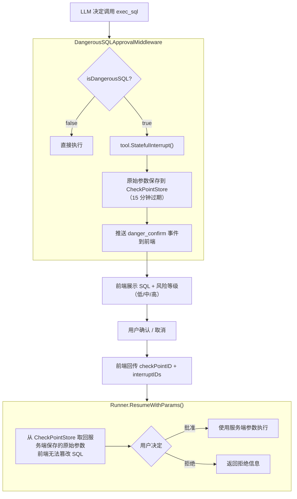
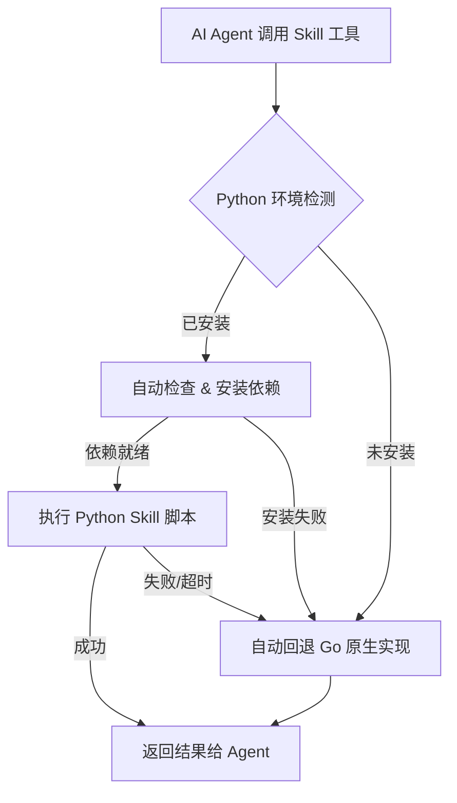
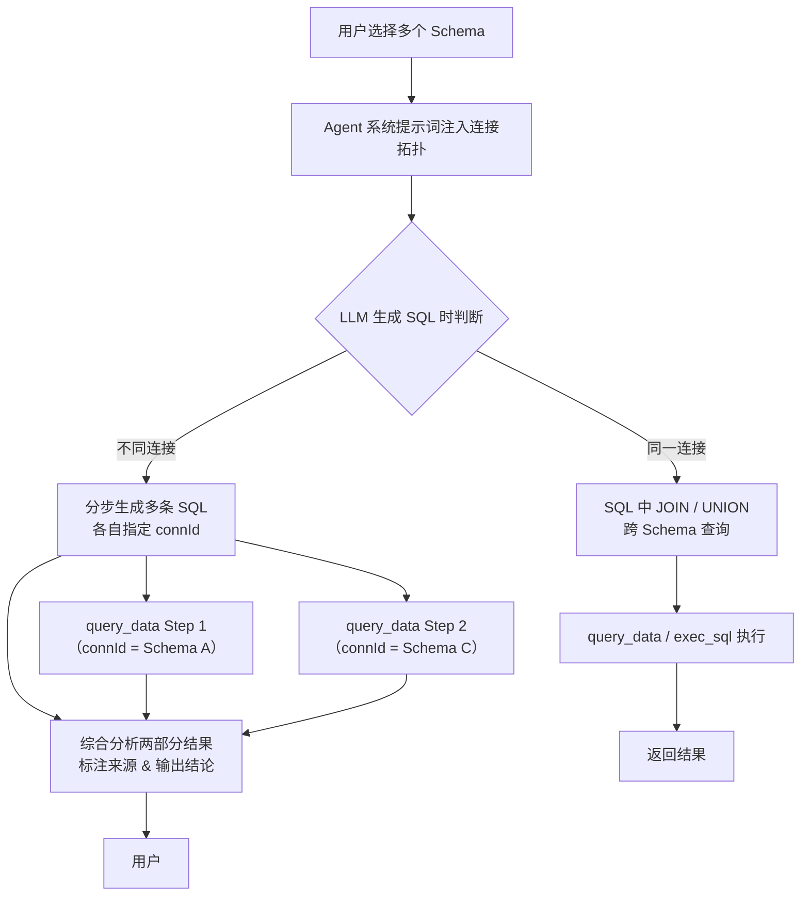
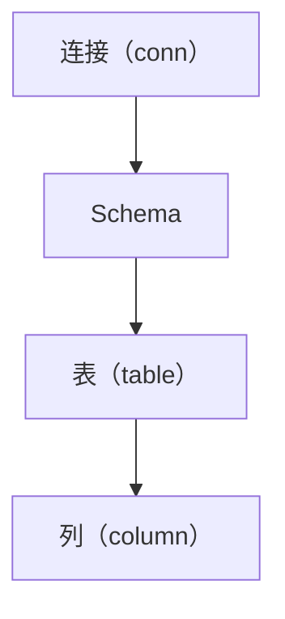
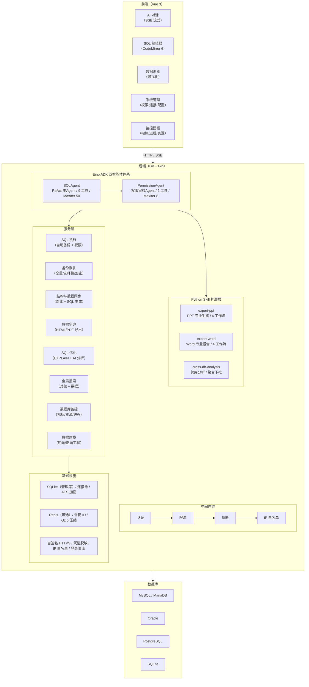

# WebSQL

**AI 原生数据库管理平台**

[](https://go.dev/)
[](https://vuejs.org/)
[](https://github.com/cloudwego/eino)
[](LICENSE)

自然语言驱动数据库操作。企业级安全保障。零依赖单文件部署。

***

WebSQL 提供两种互补的数据库交互方式，兼顾 AI 智能与经典体验：

**AI 对话模式**：将一个完全自主的 AI Agent 置于用户与数据库之间。用户无需手写 SQL、无需翻阅复杂的表结构、无需手动拼凑报告，只需用自然语言描述需求。平台的双智能体架构会生成并执行 SQL、校验权限、产出图表与专业文档，并对每一次写操作进行安全守护。

**经典视图模式**：提供完整的传统数据库管理能力——基于 CodeMirror 6 的 SQL 编辑器（语法高亮、Schema 感知自动补全、格式化）、可视化数据浏览与编辑、表结构管理、ER 图、备份恢复、结构对比与数据同步、全局搜索等，享有连接、Schema 与表级权限控制，以及 UPDATE/DELETE 自动备份、生产环境保护等安全机制。

这一切编译为单个可执行文件，无需任何外部运行时依赖。

## 对标传统工具

数据库管理工具在过去二十年里没有发生过根本性变化。Navicat、DBeaver、phpMyAdmin 都是成熟的产品，在其原始设计目标——为手写 SQL 提供图形化操作界面——上表现出色。WebSQL 在此基础上更进一步：经典视图模式下，它提供与传统工具同等级别的 SQL 编辑器体验（语法高亮、Schema 感知补全、可视化数据操作）；AI 对话模式下，它又将数据库视为 AI Agent 系统的推理目标，让自然语言成为另一种查询方式。两种模式共享同一套连接、Schema 与表级权限控制、零依赖部署体验，以及 UPDATE/DELETE 自动备份、生产环境保护等安全机制。

| 维度     | 传统工具                | WebSQL（AI 模式 / 经典模式）                                  |
| ------ | ------------------- | ------------------------------------------------------------ |
| 查询方式   | 手写 SQL              | AI 模式：自然语言驱动，AI 自动生成并执行 SQL<br>经典模式：手写 SQL，语法高亮 + Schema 感知补全 |
| 报告产出   | 导出 Excel，手动做图，粘贴进文档 | AI 模式：一句话生成含图表的 Excel / PPT / Word<br>经典模式：Excel 导入导出 |
| 写操作安全  | 依赖操作人员自觉            | AI 模式：AI 中间件自动拦截危险 SQL，前端二次确认，全程审计<br>经典模式：UPDATE/DELETE 自动备份 + 生产环境保护 |
| 权限粒度   | 连接级                 | AI 模式：连接 - Schema - 表 - 列，四级 RBAC + PermissionAgent 审核<br>经典模式：连接 - Schema - 表，三级权限控制 |
| 认证方式   | 账号密码                | 密码 / WebAuthn 生物识别 / 第三方 Token                                  |
| 部署形态   | 逐台安装客户端             | 单文件，`docker run` 或直接运行                                          |
| 协作方式   | 各自安装客户端             | 浏览器打开，团队共享                                                      |
| 错误处理   | SQL 报错，手动修改         | AI 模式：AI 自动分析错误，调整参数重试（ReAct 循环）                                  |
| 长对话处理  | 上下文溢出，状态丢失          | AI 模式：超过上下文窗口 85% 自动摘要压缩                                        |
| 跨库查询   | 逐个连接切换，手动合并         | AI 模式：AI 感知连接拓扑，自动拆分/路由 SQL                                    |
| 文档生成   | 第三方组件库或手动拼装         | AI 模式：内置 Python Skill 引擎，专业 PPT/Word 一键生成                         |
| SQL 优化 | 手动 EXPLAIN 分析       | AI 模式：AI 驱动 EXPLAIN 计划推理，给出可执行的优化建议<br>经典模式：SQL 编辑器内置 EXPLAIN 执行 |
| 结构对比   | 人工比对                | 自动化 Schema Diff，直接生成 ALTER 语句                                   |
| 数据同步   | 手动导出导入              | 自动差异识别，生成同步 SQL，分块处理大数据                                         |
| 数据库搜索  | 逐表检查                | 全局跨对象搜索，覆盖表/列/索引/视图及数据内容                                        |
| 实时监控   | 依赖外部工具              | 内置 QPS/TPS、连接池、Buffer Pool、进程列表监控                               |

## 在线体验

> [WebSQL 演示环境](http://180.184.30.223:8001/)
>
> - 账号：`admin`
> - 密码：`1`
>
> 演示服务器上行带宽有限，首次加载可能较慢。请文明使用，不要进行破坏性操作。

***

## 核心能力

### AI 双智能体架构

WebSQL 采用双智能体协作模型，基于字节跳动开源的 [CloudWeGo Eino ADK](https://github.com/cloudwego/eino) 构建：

- **SQL Agent（主智能体）**：ReAct 模式 ChatModelAgent，配备 9 个工具和 7 层中间件链。负责理解用户意图、生成 SQL 查询、执行操作、处理错误，产出从原始数据到格式化文档的各种输出。
- **Permission Agent（权限审核智能体）**：独立的 ChatModelAgent，在每次工具调用前校验其是否在用户授权范围内。解析 SQL 提取表和字段，查询权限数据库，应用"最具体优先"原则。


#### 权限审核智能体工作原理

PermissionAgent 作为 PermissionMiddleware 的内部工具运行。在每次 SQL 工具（`query_data`、`exec_sql`、`export_*`）被调用前，中间件将 SQL 文本和工具名发送给 PermissionAgent：

1. **解析 SQL**：提取所有引用的表和字段，包括 CTE 识别、子查询检测、`SELECT *` 检测
2. **查询结构**：调用 `get_table_structure` 获取目标表的列信息
3. **查询权限**：调用 `get_user_permissions` 获取用户在此连接上的权限配置
4. **逐表逐字段比对**：按"最具体优先"原则——当某 Schema 下存在 table/column 级权限时，conn/schema 级权限自动降级

当 PermissionAgent 调用失败（如 LLM 暂时不可用），系统自动降级为程序化权限检查（正则提取表名 + 查 `t_power` 表），确保安全底线不因 LLM 可用性而失效。

#### 权限检查覆盖矩阵

| 入口                      | 连接级 | 表级  | 列级（读）       | 列级（写）    | 结果集过滤 | 树可见性 |
| ----------------------- | --- | --- | ----------- | -------- | ----- | ---- |
| `/execSQL`              | 已覆盖 | 已覆盖 | --          | --       | --    | --   |
| `/exportXlsxBySql`      | 已覆盖 | 已覆盖 | --         | --       | --    | --   |
| `/importXlsx`           | 已覆盖 | 已覆盖 | --          | --       | --    | --   |
| `/showTree`             | 已覆盖 | 已覆盖 | --          | --       | --    | 已覆盖  |
| AI `query_data`（流式/非流式） | 已覆盖 | 已覆盖 | 已覆盖         | --       | 已覆盖   | --   |
| AI `exec_sql`           | 已覆盖 | 已覆盖 | --          | 已覆盖      | --    | --   |
| AI `get_table_schema`   | 已覆盖 | 已覆盖 | 已覆盖（DDL 过滤） | --       | --    | --   |
| AI `export_*`           | 已覆盖 | 已覆盖 | 已覆盖         | --       | --    | --   |
| AI `import_data`        | 已覆盖 | 已覆盖 | --          | 已覆盖（映射列） | --    | --   |

**双重防线**（AI 模式专属）：第一道（SQL 解析拦截）在工具调用前检查 SQL 文本中的表和字段；第二道（结果集过滤）在查询返回后过滤未授权列的数据，作为兜底保护。流式与非流式两条路径均已完全覆盖。经典模式仅做表级拦截，不做列级过滤。

> **模式说明**：表中 AI `*` 条目（query_data、exec_sql 等）的四级 RBAC 由 PermissionAgent（LLM 审核）+ 程序化降级共同保障，为 AI 对话模式专属。经典模式的 `/execSQL`、`/exportXlsxBySql`、`/importXlsx`、`/showTree` 提供连接、Schema 与表级权限控制；备份恢复、数据建模、数据字典、全局搜索、监控等模块提供连接级访问控制。

### 防篡改审批流

危险写操作会触发基于 Eino ADK 的 Runner + CheckPointStore 模式的中断机制：



核心安全属性：

- **批量 SQL 确认**：单次响应中若 LLM 生成多条写操作 SQL，全部中断并逐条展示，可按条选择确认/取消
- **恢复后再次中断保护**：用户确认后若 LLM 又生成新的危险 SQL，会再次中断，不会遗漏
- **风险自动分级**：无 WHERE 的 UPDATE/DELETE、DROP、TRUNCATE 标记为高风险

### Skill 扩展系统

WebSQL 内置了一套基于 Python 脚本的 Skill 扩展框架，将 AI Agent 的工具能力从 Go 原生扩展至 Python 生态，同时保持无缝回退。



#### 内置 Skill

| Skill                 | 脚本入口                                           | 核心能力                                                                      |
| --------------------- | ---------------------------------------------- | ------------------------------------------------------------------------- |
| **export-ppt**        | `skills/export-ppt/scripts/export_ppt.py`      | 专业 PPT 生成，支持 HTML 转 PPTX、模板驱动、数据驱动编程创建、OOXML 级操作 4 种工作流，8 种图表类型，3 套配色方案   |
| **export-word**       | `skills/export-word/scripts/word_generator.py` | 专业 Word 报告生成，支持数据驱动创建、OOXML 文本替换、多章节模板组装、修订追踪 4 种工作流，含封面/摘要/统计/可视化/建议完整结构 |
| **cross-db-analysis** | `skills/cross-db-analysis/scripts/analyze.py`  | 跨数据库大数据量分析，多数据源连接、SQL 聚合下推、跨库对比、分块处理、JSON 结构化输出                           |

#### Skill 框架特性

- **自动环境检测**：启动时自动检测 Python 可用性，记录版本与已发现 Skill
- **按需依赖安装**：首次调用 Skill 时自动检查并安装 `requirements.txt` 中缺失的依赖
- **优雅回退**：Python 不可用或 Skill 执行失败时，自动降级为 Go 原生实现
- **双重引擎**：Go 引擎保证基础可用，Python Skill 提供更专业品质的输出（如 Office 文档的专业排版）
- **超时保护**：每个 Skill 脚本有 120 秒执行超时，防止阻塞 Agent 流程

### 跨库操作

WebSQL 支持同时连接多个数据库 / Schema，AI Agent 能智能感知连接拓扑，自动拆分和路由 SQL。



**跨库规则**（注入 Agent 系统提示词）：

| 规则          | 说明                                                                   |
| ----------- | -------------------------------------------------------------------- |
| 连接分组        | 同连接下的 Schema 可 JOIN/UNION，不同连接必须分步查询                                 |
| connId 自动路由 | `query_data` / `exec_sql` 支持可选 `connId` 参数，根据 Schema 名自动路由到正确连接      |
| 写操作隔离       | 不同连接各自维护事务，无法跨连接回滚，Agent 需告知用户操作原子性边界                                |
| 来源标注        | 跨库分析结果须明确标注每条数据的来源（连接 + Schema）                                      |
| 大数据量防范      | 跨库组合可能产生极大结果集，须强制 LIMIT 或聚合，或使用 `export_excel` 导出                    |
| Python 脚本增强 | 超过 10 万行场景，Agent 自动调用 `cross-db-analysis` Skill，在数据库端完成聚合，仅返回结论 JSON |

### 传统 SQL 编辑器

除 AI 对话外，WebSQL 同样提供完整的传统数据库管理能力：

- **SQL 编辑器**：基于 CodeMirror 6，语法高亮、Schema 感知的自动补全（表名 + 字段名 + 注释）、格式化
- **数据浏览**：可视化表数据浏览、列过滤（支持等于/LIKE/IN/IS NULL 等操作符）、列排序、编辑、导出
- **表结构管理**：可视化建表、改表、索引管理、DDL 查看
- **数据导入导出**：Excel 导入导出（支持字段映射、新增/修改模式），SQL 导出
- **UPDATE/DELETE 自动备份**：执行前自动备份受影响数据到历史表，支持回溯
- **生产环境保护**：根据 Schema 名称自动识别测试/生产环境，生产库默认禁止写操作
- **连接、Schema 与表级权限校验**：SQL 编辑器执行入口经过连接、Schema 与表级权限校验；备份恢复、数据建模、数据字典等模块享有连接级访问控制

### SQL 优化顾问

SQL 编辑器内置 AI 驱动的优化引擎，结合数据库级 EXPLAIN 执行计划与大模型推理：

- **EXPLAIN 执行计划提取**：捕获并展示 SELECT 语句在 MySQL、PostgreSQL、Oracle 中的执行计划
- **AI 驱动分析**：大模型接收 SQL 文本、数据库类型、版本号和 EXPLAIN 输出，产出按类型（索引/性能/结构）和严重程度（严重/警告/提示）分类的结构化优化建议
- **可执行建议**：每条建议包含可读标题、详细描述，并在可能时提供改写后的 `fixSql` 语句
- **零配置**：使用与主 Agent 相同的 AI 配置，开箱即用

### 全局数据库搜索

高性能搜索引擎，可跨 Schema 定位数据库对象与数据内容：

- **对象搜索**：搜索表名、列名、索引名、视图名，按名称或注释字段匹配并高亮
- **数据搜索**：并发扫描所有表的文本类型列，匹配数据值并报告命中行数
- **分类筛选**：按类别（全部/表/列/索引/视图）过滤，支持定向查找
- **并发执行**：可配置并发数并行扫描多表，平衡搜索速度与数据库负载

### 数据库备份与恢复

完整的数据库备份恢复体系：

- **全量 Schema 备份**：导出含 `DROP TABLE IF EXISTS` 和 `INSERT` 语句的 SQL 文件
- **选择性备份**：支持逐表勾选，精确控制备份范围
- **AES 加密**：可选 AES 加密备份文件，保障存储安全
- **在线恢复**：通过 Web 界面直接恢复备份文件，事务化执行并报告详细结果
- **下载支持**：备份文件可下载为 `.sql` 文件供离线存档
- **备份历史**：完整的备份记录管理，含元数据（大小、类型、时间戳、加密状态）

### 数据字典

自动化数据字典生成，专业排版：

- **Schema 内省**：提取表名、列定义、数据类型、可空性、主键、默认值、注释、索引和行数
- **HTML 导出**：专业 HTML 文档，含封面、目录、样式化表格、索引区域和打印优化 CSS
- **PDF 导出**：通过浏览器打印生成 A4 排版 PDF
- **交互预览**：JSON API 供前端数据字典浏览
- **多数据库支持**：完整支持 MySQL、MariaDB、Oracle

### 结构对比与数据同步

数据库之间的双向结构与数据对比：

- **Schema 对比**：对比源库与目标库的表结构差异，识别新增、删除、修改的表、列、索引
- **DDL 自动生成**：自动产出 ALTER TABLE、CREATE INDEX、DROP INDEX 语句，实现目标库向源库同步
- **数据对比**：基于主键或组合键列进行逐行对比，识别新增、删除、修改的数据行
- **分块处理**：对于大表，以可配置的分块大小按主键范围分页处理，含范围外删除检测
- **同步 SQL 生成**：产出可执行的 INSERT、UPDATE、DELETE 语句，实现数据库间数据同步
- **事务化执行**：在数据库事务内执行生成的 SQL，失败自动回滚
- **方向控制**：支持源到目标、目标到源双向同步

### 数据建模与 ER 图

数据库逆向与正向工程：

- **逆向工程**：内省在线数据库，生成完整实体关系模型，包括表结构、列类型与约束、主键、外键关系和索引
- **正向工程**：向目标数据库执行 DDL 语句，创建或修改 Schema 对象，含完整的 SQL 字符串解析与语句拆分
- **模型导出**：导出为结构化 JSON 供程序使用，或导出 DDL 语句作为建库脚本
- **ER 图可视化**：前端基于 AntV X6 的 ER 图可视化，支持自动布局

### 数据库监控

实时性能监控面板：

- **指标采集**：QPS（每秒查询数）、TPS（每秒事务数）、慢查询数、锁等待数、线程统计、连接数（MySQL/MariaDB）；会话数与活跃会话数（Oracle）
- **资源监控**：数据大小、索引大小、表数量、总行数、InnoDB Buffer Pool 利用率与命中率、查询缓存命中率
- **进程列表**：完整进程列表，含用户、主机、数据库、命令、执行时长、状态信息
- **历史指标**：内存环形缓冲区存储最近 100 条指标快照，支持趋势分析
- **服务变量**：关键配置曝光（max\_connections、buffer pool size、version、character set、collation）

### 熔断器与限流

面向生产环境的韧性模式：

- **SQL 熔断器**：连续 10 次失败后熔断，30 秒冷却后进入半开状态逐步恢复
- **AI 熔断器**：连续 5 次失败后熔断，60 秒冷却，防止 LLM 端点级联故障
- **API 限流**：基于 IP 的全局限流中间件，保护所有 API 端点
- **登录限流**：针对 `/api/login` 的独立限流，每 IP 每分钟最多 10 次登录尝试
- **后台清理**：定时任务自动清理超过 7 天的导出文件

### 安全体系

#### 认证

三种登录方式，适配不同部署场景：

| 方式        | 实现               | 适用场景 |
| --------- | ---------------- | ---- |
| 密码登录      | MD5 + 盐值哈希       | 传统认证 |
| 生物识别      | WebAuthn 指纹 / 面容 | 安全便捷 |
| 第三方 Token | OAuth 对接外部认证接口   | 企业集成 |

#### 授权

四级 RBAC，向下继承——在未配置更细粒度权限时，拥有连接级权限即拥有该连接下所有资源的访问权限：



- **最具体优先原则**：当同一 Schema 下同时存在 table/column 级权限时，conn/schema 级权限自动降级，须精确匹配
- **权限自然语言注入**（AI 模式）：权限以自然语言注入系统提示词，让 LLM 在生成 SQL 时就遵守权限规则
- **树可见性独立控制**：`tree_visible` 标志独立控制每个连接/Schema/表在目录树中是否可见，与数据访问权限解耦，支持向上传播和跨角色去重

#### 审计

所有经 AI 执行的写操作自动记入 `t_sql_audit` 表，记录 SQL 文本、类型、风险等级、影响行数和执行状态。权限拒绝操作同样记录。传统 SQL 编辑器的 UPDATE/DELETE 操作执行前自动备份数据到 `t_history`。

#### IP 白名单

本地模式下可配置 IP 白名单，限制只有指定 IP 地址能够访问，提供额外的网络层安全防护。

## 技术架构



### 后端技术栈

| 组件        | 技术                         | 说明                                               |
| --------- | -------------------------- | ------------------------------------------------ |
| Web 框架    | Gin                        | HTTP 路由、中间件、SSE 流式                               |
| AI 框架     | Eino ADK v0.8              | 双 Agent、Runner、CheckPointStore、StatefulInterrupt |
| LLM 接入    | OpenAI / Ollama            | 通过 eino-ext 适配器，兼容任何 OpenAI 兼容接口                 |
| 数据库驱动     | sqlx + mysql/oracle/sqlite | 多数据库方言支持                                         |
| Excel     | excelize/v2                | 读写 Excel、内嵌图表、StreamWriter 流式写入                  |
| 图表        | go-chart/v2                | PNG 图表渲染（折线/柱状/饼图/散点）                            |
| Office 文档 | 原生 Open XML                | DOCX/PPTX 零依赖生成，直接构建 OOXML                       |
| 管理库       | SQLite（modernc，CGO-free）   | 用户/连接/会话/审计，纯 Go 实现                              |
| 缓存        | 内存 + Redis（可选）             | 滑动过期支持，Redis 分布式 Session 30 分钟 TTL               |
| 加密        | AES-ECB                    | 数据库连接密码加密存储                                      |
| ID 生成     | 雪花算法                       | 分布式唯一 ID，单节点每毫秒 4096 个                           |
| Skill 引擎  | Python 3 + pip             | 自动环境检测、按需依赖安装、Go 回退双重引擎                          |
| 韧性        | 熔断器 + 限流器                  | SQL/AI 双熔断，IP 级限流中间件                             |

### 前端技术栈

| 组件       | 技术                          | 说明                     |
| -------- | --------------------------- | ---------------------- |
| 框架       | Vue 3 + Composition API     | 响应式、组合式 API            |
| UI 库     | Element Plus                | 中文 locale，虚拟滚动表格       |
| SQL 编辑器  | CodeMirror 6                | 语法高亮、Schema 感知自动补全、格式化 |
| Markdown | markdown-it + mermaid       | AI 回复渲染，Mermaid 流式渲染   |
| 数学公式     | KaTeX + markdown-it-texmath | 数学公式渲染                 |
| ER 图     | @antv/x6 + @antv/layout     | 实体关系可视化                |
| 认证       | @passwordless-id/webauthn   | 指纹 / 面容生物识别            |
| 语音输入     | Web Speech API              | 中文语音识别                 |
| 构建       | Vite                        | 快速开发与构建                |

## 项目结构

```
websql/
├── main.go                       # 入口：HTTP 服务启动、优雅关闭
├── config/
│   ├── config.go                 # 配置加载（config.json + 数据库覆盖）
│   ├── db.go                     # 数据库连接池管理、心跳检测
│   └── init_db.go                # SQL 脚本初始化
├── web-api/
│   ├── router.go                 # 路由注册，中间件链（认证/CORS/Recovery/IP 白名单）
│   ├── sql_exec.go               # 传统 SQL 执行（自动备份 + 表级权限）
│   ├── export.go                 # 传统数据导出（StreamWriter 流式写入 + 表级权限）
│   ├── import.go                 # 传统数据导入（事务保证，列映射 + 表级权限）
│   ├── ratelimit.go              # 登录限流中间件（IP 级别，10 次/分钟）
│   ├── circuit_breaker.go        # 熔断器中间件（SQL + AI）
│   ├── cleanup.go                # 导出文件定时清理（7 天 TTL）
│   ├── admin/                    # 管理 API
│   │   ├── admin.go              # 用户 CRUD、密码哈希、树可见性聚合
│   │   ├── login.go              # 三种登录方式（密码/生物识别/Token）
│   │   ├── conn_config.go        # 连接配置管理（AES 加密存储）
│   │   ├── db_operate.go         # 数据库操作 API（含表级权限过滤）
│   │   ├── sql_analyzer.go       # SQL 分析器：提取操作类型、表、写列
│   │   ├── sql_permission.go     # 经典模式权限校验：表级查询 + SELECT 列提取 + DDL 过滤
│   │   ├── tree_permission.go    # 目录树权限过滤（conn/schema/table/dir 四级）
│   │   ├── tree_mg.go            # 数据库导航树（权限感知 + tree_visible 过滤）
│   │   ├── system_config.go      # 系统配置（双层：文件 + 数据库）
│   │   └── prompt.go             # 提示词管理（个人/分享/角色三级）
│   ├── ai/
│   │   ├── ai_config.go          # AI 配置管理
│   │   ├── ai_handler.go         # AI 路由注册
│   │   └── agent/v2/             # Eino ADK 双 Agent 体系
│   │       ├── agent.go          # SQLAgent 核心：模型构建、系统提示词、Runner 流式执行
│   │       ├── handler.go        # HTTP Handler：SSE 流、Keep-Alive、会话管理、恢复执行
│   │       ├── tools.go          # 工具实现：query_data / exec_sql / get_table_schema / import_data
│   │       ├── export/           # 导出子模块
│   │       │   ├── tools.go      # 导出工具入口：Excel / Excel+Chart
│   │       │   ├── excel.go      # Excel 文件生成（含样式/合并/图表嵌入）
│   │       │   ├── pptx.go       # PPTX Open XML 生成（零依赖）
│   │       │   ├── docx.go       # DOCX Open XML 生成（零依赖）
│   │       │   ├── chart.go      # go-chart PNG 图表渲染
│   │       │   ├── markdown.go   # Markdown 导出
│   │       │   ├── skill_detector.go  # Python 环境检测 & Skill 生命周期
│   │       │   ├── skill_export.go    # Skill 导出（PPT/Word/跨库分析）
│   │       │   └── types.go      # 导出数据类型定义
│   │       ├── middleware.go     # 中间件：防篡改审批 / 错误恢复 / 调用日志 / 结果精简
│   │       ├── permission.go     # PermissionScope + PermissionMiddleware（双重防线）
│   │       ├── permission_agent.go       # PermissionAgent：LLM 驱动的权限审核智能体
│   │       ├── permission_agent_tools.go # PermissionAgent 工具：表结构 + 用户权限查询
│   │       ├── checkpoint_store.go       # 内存 CheckPointStore（15 分钟自动过期）
│   │       ├── session_db.go     # 会话持久化（内存缓存 + 数据库）
│   │       ├── audit.go          # SQL 审计日志（权限拒绝 + 执行记录）
│   │       └── import_upload.go  # Excel 上传暂存（30 分钟自动清理）
│   ├── backup/                   # 备份恢复模块
│   │   └── backup.go             # 创建/列表/恢复/删除/下载备份，AES 加密
│   ├── sync/                     # 结构与数据同步
│   │   ├── schema_diff.go        # Schema 对比，DDL Diff，ALTER 语句生成，执行
│   │   └── data_sync.go          # 数据对比，分块处理，同步 SQL 生成，执行
│   ├── modeler/                  # 数据建模
│   │   └── modeler.go            # 逆向/正向工程，ER 模型提取，DDL 导出
│   ├── datadict/                 # 数据字典
│   │   └── dict.go               # 字典生成，HTML/PDF 导出，交互浏览
│   ├── search/                   # 全局数据库搜索
│   │   └── search.go             # 对象搜索（表/列/索引/视图），数据搜索，并发扫描
│   ├── monitor/                  # 数据库监控
│   │   └── monitor.go            # QPS/TPS 指标，Buffer Pool，进程列表，服务变量，历史
│   └── sqlopt/                   # SQL 优化
│       └── optimize.go           # EXPLAIN 执行，AI 驱动优化建议
├── utils/                        # 工具包
│   ├── security_helper.go        # AES 加密/解密
│   ├── errutil.go                # 凭证脱敏（password/token/DSN/IP 自动替换）
│   ├── id.go                     # 雪花算法 ID 生成器
│   ├── json.go                   # JSON Gzip 压缩（>= 20 字节自动压缩）
│   ├── store/
│   │   ├── store.go              # 内存缓存 + Redis 双模式（滑动过期，30min TTL）
│   │   └── redis.go              # Redis 连接管理
│   └── db/
│       └── sql_dialect.go        # 多数据库 SQL 方言映射
├── https/                        # HTTPS 自动配置（自签名证书自动生成/续期）
├── logutils/                     # 日志工具
├── skills/                       # Python Skill 扩展脚本
├── web-src/                      # 前端源码（Vue 3）
│   └── src/
│       ├── App.vue               # 主界面：AI 对话 + SSE 流式 + Mermaid 渲染 + 语音 + Excel 上传
│       ├── views/                # 页面
│       │   ├── SQLEditor2.vue          # SQL 编辑器（CodeMirror 6 + 虚拟滚动表格）
│       │   ├── DataBrowser.vue         # 数据浏览（列过滤/排序/CRUD）
│       │   ├── ClassicalView.vue       # 经典视图（数据库树 + 多标签页）
│       │   ├── TableManager.vue        # 表管理（字段/索引/选项/DDL）
│       │   ├── SystemManagement.vue    # 系统管理入口
│       │   ├── RolePermission.vue      # 四级权限配置（含 tree_visible）
│       │   ├── SQLAuditLog.vue         # SQL 审计日志
│       │   └── ...                     # 更多管理页面
│       ├── components/           # 组件
│       │   ├── SQLConfirmInline.vue    # 危险 SQL 确认（风险等级 + 关键字高亮）
│       │   ├── ERDiagramDialog.vue     # ER 图可视化
│       │   ├── BackupRestoreDialog.vue # 备份恢复对话框
│       │   ├── DataSyncDialog.vue      # 数据同步对话框
│       │   ├── SchemaCompareDialog.vue # 结构对比对话框
│       │   ├── SQLOptimizePanel.vue    # SQL 优化面板
│       │   ├── GlobalSearchDialog.vue  # 全局搜索对话框
│       │   ├── EnhancedMonitorPanel.vue # 监控面板
│       │   ├── DataDictDialog.vue      # 数据字典对话框
│       │   ├── ImportPreviewDialog.vue # Excel 导入预览（字段映射 + 预览）
│       │   └── ...
│       └── utils/
│           ├── sqlRiskAssessment.js    # SQL 风险评估（前端）
│           ├── errorHandler.js         # 错误脱敏
│           └── vditorLoader.js         # Vditor 懒加载
├── config.json                   # 运行时配置
├── sqlite3-init.sql              # SQLite 初始化脚本
├── mysql-init.sql                # MySQL 初始化脚本
└── Dockerfile                    # Docker 部署
```

## 快速开始

### 环境要求

- Go 1.26+（编译）
- Node.js 18+（前端开发，仅开发时需要，生产部署不需要）

### 编译运行

```bash
# 克隆项目
git clone <repo-url> && cd websql

# 编译后端
go build -o websql .

# 初始化数据库（首次运行）
./websql -sql sqlite3-init.sql

# 启动服务
./websql -port 8080
```

### Docker 部署

```bash
docker build -t websql .
docker run -d -p 443:443 -v ./data:/app/data websql
```

### 前端开发

```bash
cd web-src
npm install
npm run dev    # 开发服务器（localhost:5173）
npm run build  # 构建到 static/
```

## 配置说明

### config.json

```json
{
  "isRemote": true,
  "db": {
    "type": "sqlite",
    "dsn": "./nway.sqlite3.db"
  },
  "https": {
    "enable": true,
    "organization": "Nway",
    "commonName": "websql.nway.com"
  }
}
```

### AI 配置

通过系统管理界面配置，支持参数：

| 参数               | 说明                       |
| ---------------- | ------------------------ |
| provider         | `openai` 或 `ollama`      |
| baseUrl          | API 地址（支持任何 OpenAI 兼容接口） |
| model            | 模型名称                     |
| apiKey           | API 密钥                   |
| temperature      | 温度参数                     |
| maxTokens        | 最大 token 数               |
| maxContextTokens | 模型上下文窗口大小（用于自动摘要触发计算）    |
| enableThinking   | 是否启用思考过程（Ollama）         |

### 双模式运行

| 模式   | isRemote | 权限管理                              | 适用场景      |
| ---- | -------- | --------------------------------- | --------- |
| 本地模式 | false    | 无（所有用户可访问所有连接）                    | 个人开发、内网使用 |
| 远程模式 | true     | 严格 RBAC + AI 权限审核 + IP 白名单 + 登录限流 | 团队协作、生产环境 |

## 数据库支持

| 数据库             | 查询 | 写操作 | 可视化编辑 | 导入导出 | AI 方言适配 |
| --------------- | -- | --- | ----- | ---- | ------- |
| MySQL / MariaDB | 支持 | 支持  | 支持    | 支持   | 支持      |
| Oracle          | 支持 | 支持  | 部分支持  | 支持   | 支持      |
| SQLite          | 支持 | 支持  | 支持    | 支持   | 支持      |

## 开源优势

WebSQL 基于 MIT 许可证开源，我们相信数据库管理工具应当是透明、可信赖的。

### MIT 许可证：最大自由度

- **无限制商用**：可自由集成到商业产品中，无需支付授权费用
- **完全可修改**：源码开放，可按需定制、二次开发
- **无 Copyleft 限制**：修改后的代码无需强制开源，适合企业内部定制与闭源分发
- **自由分发**：可重新分发、转售、嵌入到自有产品中

### 数据主权与自托管

WebSQL 运行在你自己的服务器上，数据库连接凭证、查询记录、AI 会话数据**完全由你掌控**：

- **单文件部署**：编译产物为单个可执行文件，无需外部运行时，部署即掌控
- **数据不离开服务器**：所有数据存储在本地 SQLite（管理库）和你的目标数据库中
- **支持离线运行**：AI 功能支持本地 Ollama 部署，完全脱离云端服务
- **自签名 HTTPS**：内置证书自动生成，内网部署也能加密通信

### 零遥测 / 隐私优先

WebSQL **不包含任何遥测、用户行为追踪或数据收集代码**。你的数据库操作、SQL 查询习惯、AI 对话内容永远不会被发送到任何第三方服务器。代码完全公开可审计，每一行都可查证。

### 零供应商锁定

- **标准协议与格式**：基于标准 SQL、标准 HTTP/SSE 协议，数据可随时导出为标准格式
- **开源技术栈**：Go + Vue 3，业界最广泛使用的技术栈之一，人才储备充足
- **自给自足**：不依赖任何商业授权服务器、许可证激活或云服务订阅

### 社区驱动

- **完全开放源码**：所有功能模块（AI Agent、权限体系、数据库同步、ER 图等）均无"企业版"限制
- **欢迎贡献**：Bug 报告、功能建议、代码贡献均通过 GitHub Issues/Pull Requests 进行
- **Skill 扩展**：Python Skill 系统允许社区贡献新的数据库分析、导出、可视化能力

## License

[MIT](LICENSE)
