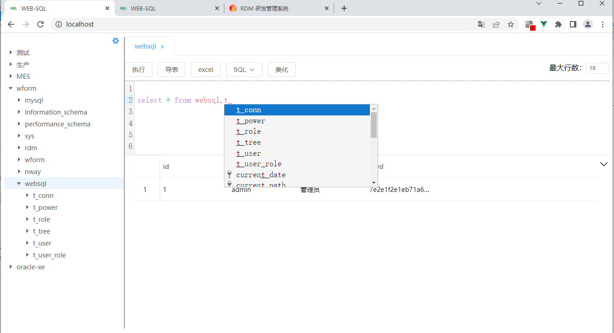

# Web-SQL
    
web版数据库管理工具，由go+vue编写，可以做到无依赖跨平台，编译后无需安装运行环境。


1. 支持本地模式和远程部署模式
2. 支持高亮和自动提示SQL关键字及表名
3. 支持基于操作系统的人脸/指纹识别登录
4. 支持自动备份delete、update操作的数据
5. 支持excel导入导出、insert/update/create脚本导出


### 开源协议宽松，可以自由使用，以满足个人或企业需求。


## 演示地址 http://124.221.221.247:8090
  管理员账号：admin/1
  
  指纹/人脸识别仅在用户操作系统及硬件支持且https下证书有效或http下使用localhost访问时才被支持。



## 运行参数
  -port 运行端口号，默认80

  -https 是否为https，默认false

## 配置文件
  文件名：config.json

```
{
    // 是否为远程模式，默认false。远程模式下数据库连接有严格的权限管理，也有会话管理，适合团队共享连接的情况下使用。false时没有权限管理，仅建议本机使用。
    "isRemote": true,
    // 详情参考https://pkg.go.dev/modernc.org/sqlite
    // https://pkg.go.dev/github.com/go-sql-driver/mysql
    // https://pkg.go.dev/github.com/sijms/go-ora/v2
    "db": {
        "type": "sqlite",  // sqlite、 mysql、oracle（oracle暂时只有sql相关操作靠谱）
        "dsn": "nway.sqlite3.db"    // sqlite：数据库文件路径；mysql：user:password@tcp(host:port)/db?params
    },
    // 详情参考 https://pkg.go.dev/github.com/redis/go-redis/v9
    "redis": {
        "addr": "", // host:port
        "password":"",
        "db": 0
    },
    // https 时创建证书的参数
    "https": {
      "organization": "Nway",
      "commonName": "websql.nway.com"
    },
    // 基于外部token登录的验证接口
    "outterUser": "http://localhost:8081/nway-system/login/getLoginUser",
    // isRemote = false 时允许访问的IP地址
    "allowedIP": [
      "[::1]",
      "127.0.0.1"
    ]
}
```

## 使用自定义配置在docker运行，可以参考
```
docker run -d -p8000:80 -v ./config.json:/app/config.json -v ./nway.sqlite3.db:/app/nway.sqlite3.db zdtjss/websql:v1.5
```
