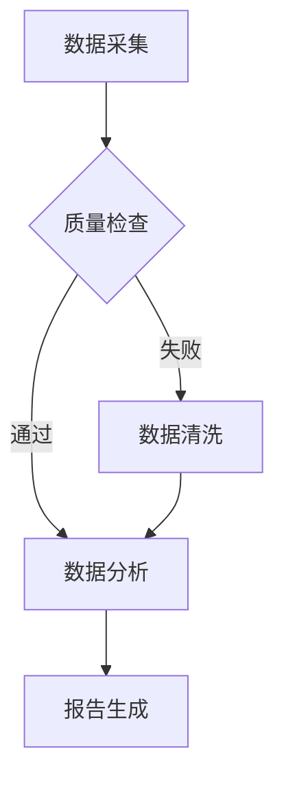

# HTML 报告生成 Skill

本 Skill 指导 Agent 生成交互式 HTML 报告。**Agent 负责组织 Markdown 内容，export_html 工具负责渲染**。

## 工作流（Agent 必须按序执行）

### 场景 A：用户提供了分析文本（content 模式）

1. **组织内容**：把分析结论整理成 Markdown 文本（支持标题/列表/表格/代码块/mermaid/公式）
2. **调用工具**：调用 `export_html` 工具，参数：
   ```json
   {
     "content": "<Markdown 文本>",
     "fileName": "report_20260619",
     "title": "报告标题"
   }
   ```

### 场景 B：用户提供了 SQL（sql 模式）

1. **取数**：用 `query_data` 工具执行 SQL（或直接把 SQL 传给 export_html 工具）
2. **调用工具**：调用 `export_html` 工具，参数：
   ```json
   {
     "sql": "<SELECT SQL>",
     "fileName": "report_20260619",
     "title": "报告标题"
   }
   ```
   工具会自动查询并生成统计摘要 + 数据明细表格

### 场景 C：需要深度分析（推荐）

1. **取数**：用 `query_data` 取数
2. **分析**：Agent 基于数据生成 Markdown 分析报告（含 mermaid 流程图、表格、结论）
3. **导出**：调用 `export_html` 工具，content 模式传入分析 Markdown

## Markdown 语法支持

| 语法 | 示例 | 说明 |
|------|------|------|
| 标题 | `# H1` `## H2` | 1-6 级 |
| 表格 | `\| col \| col \|` | GFM 表格 |
| 代码块 | ` ```python ` | 支持高亮 |
| Mermaid | ` ```mermaid ` | **可缩放/全屏/查看源码** |
| 数学公式 | `$E=mc^2$` | KaTeX 渲染 |
| 任务列表 | `- [x] done` | GFM task list |
| 引用 | `> quote` | 块引用 |
| 图片 | `` | 居中带图注 |

## Mermaid 图表示例

```markdown

```

生成的 HTML 中，每个 mermaid 图块都支持：
- **放大/缩小**：按钮或鼠标滚轮（0.3x ~ 5x）
- **拖拽平移**：鼠标拖动
- **全屏**：⛶ 按钮，ESC 退出
- **查看源码**：`</>` 按钮，可复制
- **还原**：↺ 按钮重置

## 失败处理

export_html 工具是 Go 原生实现，无外部依赖，几乎不会失败。若 SQL 查询失败，会返回错误信息。

## 输出路径规则

- 工具自动生成文件名：`/exports/<fileName>_<timestamp>.html`
- 下载链接：`/exports/<fileName>_<timestamp>.html`

## 与其他 Skill 对比

| Skill | 输出格式 | 优势 | 适用场景 |
|-------|---------|------|---------|
| export-html | .html | 交互式、支持 mermaid 缩放、无需 Python | 在线浏览、复杂图表 |
| export-word | .docx | 可编辑、正式 | 正式报告、打印 |
| export-ppt | .pptx | 演示导向 | 汇报、演讲 |
